# 1. Apresentação

Este manual descreve a utilização da ferramenta BHO2MGB, disponibilizada como plugin para o software QGIS. A ferramenta realiza o pré‑processamento do modelo hidrológico MGB de forma integrada à Base Hidrográfica Ottocodificada (BHO), disponibilizada pela Agência Nacional de Águas e Saneamento (ANA).

**Autores**

- Rafael Barbedo
- Gabriel Matte Rios Fernandez
- Rafaela Cristina de Oliveira
- Leonardo Laipelt
- Fernando Fan
- Walter Collischonn

**Repositório:** [github.com/hge-admin/BHO2MGB](https://github.com/hge-admin/BHO2MGB)

# 2. Introdução

O Modelo de Grandes Bacias (MGB) (COLLISCHONN et al., 2007) é um modelo de simulação hidrológica e hidrodinâmica, que possui uma interface acoplada ao software de geoprocessamento QGIS. Ele permite realizar simulações e obter resultados de vazão, evapotranspiração, áreas inundadas, entre outros.

A etapa de pré‑processamento do MGB é a parte do processo de elaboração do modelo de uma bacia hidrográfica em que esta bacia é subdividida em unidades menores, denominadas minibacias, através de um procedimento de discretização. Desde 2016, o modelo conta com uma ferramenta de pré‑processamento, denominada IPH-Hydro Tools, que utiliza um Modelo Digital de Elevação (MDE) para discretizar a bacia e coletar as informações necessárias para a etapa de simulação (Siqueira et al., 2016), e que é disponibilizada na forma de um plugin do software QGIS. Tradicionalmente, esta era a única forma de realizar o pré‑processamento do modelo MGB.

Na sua versão mais atual, no entanto, o MGB uma segunda abordagem foi desenvolvida para a realização do pré‑processamento, que é a metodologia BHO2MGB. Essa metodologia utiliza as informações previamente existentes da Base Hidrográfica Ottocodificada (BHO), disponibilizada pela Agência Nacional de Águas (ANA). A BHO é uma forma de representar a rede hidrográfica brasileira, atualmente utilizada por orgãos oficiais, como Agência Nacional de Águas e Saneamento (ANA). Na BHO, cada trecho é associado a uma superfície de drenagem denominada ottobacia, à qual é atribuída a codificação de bacias de Otto Pfafstetter.

No plugin BHO2MGB, a discretização da bacia em minibacias é feita com base nos trechos e polígonos da BHO. Assim, não é necessário o pré‑processamento através do IPH-HydroTools. Isto ocorre porque a BHO já tem nos seus atributos quase todas as informações necessárias para compor o arquivo de entrada principal do modelo MGB. A principal vantagem da ferramenta BHO2MGB é que os resultados do modelo podem ser facilmente transferíveis para a rede hidrográfica oficial adotada pela ANA atualmente, facilitando a obtenção de informações relevantes para a gestão de recursos hídricos. Outra vantagem é que, ao adotar os dados da BHO, o processo de discretização da bacia hidrográfica para aplicação do modelo MGB é muito mais rápido do que a alternativa que parte do processamento do MDE com o conjunto de ferramentas IPH Hydro Tools.

Neste manual, será apresentada a realização do pré‑processamento do MGB com base na BHO, assim como uma aplicação do modelo, na bacia do Rio Carinhanha. Serão abordados os procedimentos desde o download e obtenção dos dados de entrada até a visualização dos resultados da simulação.

# 3. Download e instalação

O download do plugin pode ser diretamente da página web do Grupo de Pesquisa de Hidrologia de Grande Escala (HGE), através do seguinte link:

- https://github.com/HGE-IPH/BHO2MGB/releases

Uma vez feito o download, o usuário deve iniciar o QGIS (última versão testada: 3.44), e instalar o complemento (plugin). Para instalar o plugin no QGIS clique na aba “Complementos” e selecione “Gerenciar e Instalar Complementos”, como mostra a

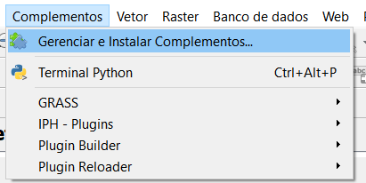

**Figura 1. Aba de complementos**

Em “Install from ZIP” selecione a pasta .zip (gerada no download) em “ZIP file” e clique em “Install Plugin”, como mostra a Figura 2.

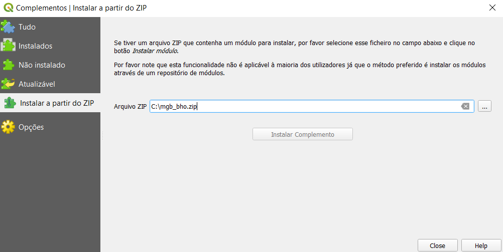

**Figura 2. Janela para instalar plugin.**

A Figura 3 apresenta como o plugin irá aparecer na sua barra de tarefas do QGIS, pronto para uso.

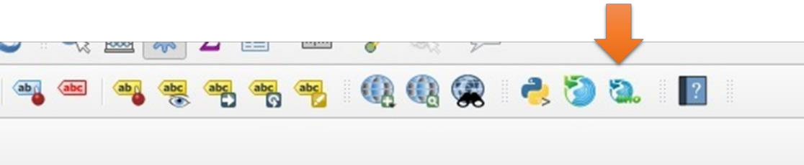

**Figura 3. Aparência do ícone do plugin BHO2MGB na barra de ferramentas após sua instalação.**

# 4. Aplicação na bacia hidrográfica do rio Carinhanha

No exemplo que segue, a ferramenta BHO2MGB é aplicada na bacia hidrográfica do rio Carinhanha, localizada entre Minas Gerais e Bahia. O exemplo inclui desde a obtenção dos dados de entrada até a simulação no MGB.

A obtenção dos dados de entrada para a discretização da bacia é realizada utilizando um aplicativo WebGIS que utiliza o Google Earth Engine (GEE) como repositório dos dados, conforme descrito no item 4.1.1. Alternativamente, os dados podem ser obtidos diretamente do portal de metadados da ANA e de outras bases de dados, conforme descrito no item 4.1.2. O pré‑processamento dos dados da BHO para aplicação do modelo MGB é realizado utilizando o plugin BHO2MGB, conforme descrito no item 4.2. Finalmente, a aplicação do modelo MGB com os dados gerados pelo pré‑processamento BHO2MGB é apresentada no item 4.3.

## 4.1. Obtenção dos dados de entrada

Para a utilização do BHO2MGB, são necessários os arquivos vetoriais da BHO (trechos e áreas), um modelo digital de elevação (MDE) e um mapa de unidades de resposta hidrológica (URH). No contexto da ferramenta BHO2MGB, foi desenvolvido um aplicativo WebGIS que utiliza o Google Earth Engine (GEE) como repositório dos dados, e facilita a sua extração para uma bacia específica.

O aplicativo WebGIS permite realizar o download de todos os arquivos de entrada, assim como de alguns arquivos auxiliares, diretamente para a bacia de interesse, selecionada pelo exutório BHO. Essa é a maneira recomendada de obter os arquivos, porém também abordaremos maneiras alternativas, embora o usuário não esteja limitado a estas. Mais detalhes sobre as abordagens serão cobertos a seguir.

### 4.1.1. Obtenção via ferramenta no Google Earth Engine (GEE)

O Google Earth Engine (GEE) é uma plataforma de computação em nuvem que possibilita o acesso rápido a diversas bases de dados de sensoriamento remoto e a criação de códigos, aplicativos e ferramentas para operacionalizar a extração e manipulação destes dados.

Há duas formas alternativas para utilizar a plataforma GEE para a extração de dados da BHO da bacia hidrográfica onde se deseja aplicar o modelo MGB, conforme apresentado na Tabela 1. As duas formas têm a mesma função, e permitem acessar os mesmos dados. A vantagem da primeira forma é que permite extrair os dados de bacias de qualquer tamanho. A vantagem da segunda forma é que a aplicação é mais simples, porém o seu uso é limitado para bacias cuja área de drenagem é menor do que, aproximadamente, 10 mil a 50 mil km2 (o valor exato deste limiar depende da forma da bacia e da resolução espacial do MDE escolhido pelo usuário).

**Tabela 1. Formas alternativas para utilizar a plataforma GEE para extração de dados da BHO da bacia hidrográfica onde se deseja aplicar o modelo MGB.**

| Nome | Link | Descrição | Características |
|---|---|---|---|
| Code Editor | [Google Earth Engine](https://code.earthengine.google.com/65dd79c065e8a77cc49d148a426adfa3) | Editor de código do GEE | Mais complexa; permite baixar dados de bacias maiores. |
| Earth Engine App | [Aplicativo GEE](https://bho2mgb.users.earthengine.app/view/mgbbhotoolkit) | Aplicativo GEE sem acesso ao código | Mais simples; não pode ser utilizado em bacias muito grandes. |

As duas formas descritas na Tabela 1 fazem o mesmo processamento, requerem as mesmas entradas e retornam os mesmos arquivos de saída. No entanto, o primeiro link, correspondente ao Code Editor, apresenta a ferramenta na forma de um código para executar no editor de códigos da plataforma e realizar os downloads para conta no Google Drive do usuário. O segundo link, correspondente ao Earth Engine App, apresenta o código na forma de um aplicativo do Earth Engine, sem contato nenhum do usuário com os códigos que envolvem o processamento da ferramenta, e realiza os downloads direto para a máquina do usuário de maneira mais rápida, porém mais limitada em grandes áreas.

Independentemente da forma em que é aplicada, a ferramenta faz a extração de dados para uma bacia hidrográfica escolhida pelo usuário, que indica a localização do exutório, ou ponto final da bacia. Os dados que podem ser extraídos são:

- Arquivos vetoriais da Base Hidrográfica Ottocodificada da ANA;

- Arquivos raster de Modelos Digitais de Elevação;

- Séries temporais de chuva a partir de dados em grid;

- Arquivos raster de vegetação, declividade, unidades de paisagem e classes de resposta hidrológica.

O usuário pode escolher qual entre as diversas versões da BHO vai utilizar. Da mesma forma, o usuário pode escolher qual MDE vai utilizar na aplicação a partir de uma pré-seleção de produtos. Além disso, o usuário também pode escolher o produto de estimativa de precipitação do qual pretende obter dados, todos com dados diários (Tabela 2).

**Tabela 2. Produtos disponibilizados pela ferramenta de extração de dados via Google Earth Engine.**

| Dados | Base de dados | Versão | Disponibilidade | Resolução espacial | Referência |
|---|---|---:|---|---|---|
| Estimativas de precipitação | GPM IMERG | 6 | 2000–presente | 0,1° | Huffman et al., 2019 |
| Estimativas de precipitação | CHIRPS | 1 | 1981–presente | 0,05° | Funk et al., 2015 |
| Estimativas de precipitação | GLDAS | 2.1 | 2000–presente | 0,25° | Rodell et al., 2004 |
| Estimativas de precipitação | PERSIANN | 1 | 1983–presente | 0,25° | Sorooshian et al., 2015 |
| Estimativas de precipitação | ERA5 | — | 1981–presente | 0,1° | Hersbach et al., 2020 |
| Modelos digitais de elevação | MERIT | 1 | — | 3 arco-segundos | Yamazaki et al., 2017 |
| Modelos digitais de elevação | SRTM | 4 | — | 3 arco-segundos | Jarvis et al., 2008 |
| Modelos digitais de elevação | SRTM | 3 | — | 1 arco-segundo | Farr et al., 2007 |
| Modelos digitais de elevação | NASADEM | 1 | — | 1 arco-segundo | NASA JPL, 2020 |

A ferramenta foi desenvolvida em JavaScript no editor de códigos do GEE, e não requer do usuário conhecimentos em linguagem de programação, pois o código realiza a construção de uma interface gráfica de fácil utilização. Mesmo a versão da ferramenta no editor de código possui uma interface gráfica que facilita a sua aplicação. A Figura 4 apresenta o menu principal da ferramenta.

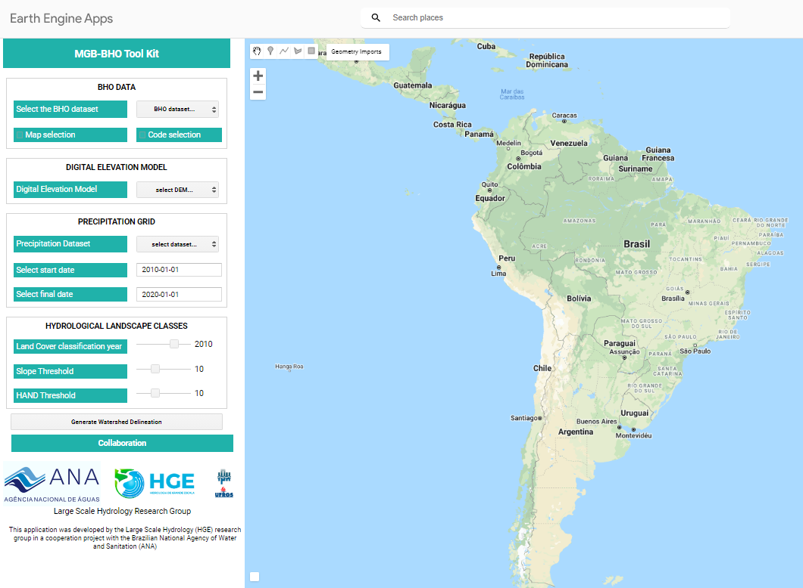

**Figura 4. Menu principal do MGB-BHO Tool Kit.**

O primeiro passo para a aplicação da ferramenta é a escolha da versão da BHO com a qual se deseja trabalhar. São disponibilizados os dados nas escalas 50k, 5k e 250 para escolha do usuário através de um painel de seleção (Figura 5). Na nossa aplicação, utilizaremos a BHO 250.

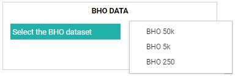

**Figura 5. Seleção da escala dos dados da BHO.**

Em seguida, o usuário deve selecionar o exutório da bacia que deseja delimitar. Isto pode ser realizado de duas maneiras: a primeira sendo a seleção direta das coordenadas do exutório no mapa através da ferramenta “Map selection”; e a segunda através da ferramenta “Code selection” onde o usuário deve informar o código pfafstetter (atributo “cobacia”) da BHO que corresponde à minibacia BHO do exutório. Ambas as ferramentas podem ser visualizadas na Figura 6. A delimitação da bacia hidrográfica é feita a partir dos arquivos de áreas e trechos da BHO com um filtro que seleciona todos os trechos e áreas a montante da minibacia BHO selecionada como exutório. Para selecionar a bacia do rio Carinhanha fazemos a seleção na ferramenta pelo código 67658111.

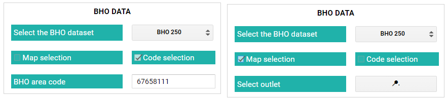

**Figura 6. Seleção do exutório para delimitação da bacia hidrográfica a partir da definição do código da área da BHO do exutório (esquerda) e a partir da definição do exutório no mapa da plataforma (direita).**

Após a seleção dos dados referentes à BHO, o usuário deve escolher no segundo bloco o Modelo Digital de Elevação (MDE) que deseja utilizar em sua aplicação. A escolha é realizada a partir de uma ferramenta com uma pré-seleção de produtos. No nosso caso, selecionaremos o NASA-DEM 30m, como mostra a Figura 7.

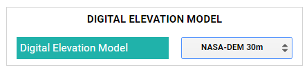

**Figura 7. Seleção do DEM.**

Em seguida, o usuário deve definir as informações para a geração do grid de precipitação que constam no terceiro bloco da ferramenta. O usuário pode escolher entre os produtos de estimativas de precipitação pré-selecionados, da mesma forma que foi realizada a escolha do DEM e o período para o qual deseja obter dados (Figura 8). Utilizaremos aqui dados da constelação CHIRPS no período de 2000-01-01 a 2020-12-31.

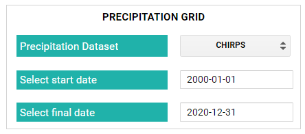

**Figura 8. Seleção do produto e período de interesse para o grid de precipitação.**

O resultado do processamento dos dados de precipitação é uma tabela .csv com a série temporal de precipitação para cada pixel do produto selecionado que se localiza dentro da extensão da bacia hidrográfica. Esses dados podem ser utilizados posteriormente como dado de entrada do MGB, após pré‑processamento.

Por último, antes de aplicar a ferramenta, o usuário deve definir os parâmetros para o processamento das HLCs. Os parâmetros necessários são o ano do mapa de classificação de uso do solo que será utilizado, um limiar de declividade para definir classes do terreno e um limiar de altura do modelo HAND para a classificação de áreas úmidas. A Figura 9 apresenta o quarto bloco da ferramenta, onde constam os parâmetros necessários para esse processamento. Podemos deixar esses parâmetros no valor padrão.

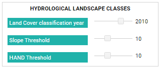

**Figura 9. Parâmetros utilizados no processamento das Hydrological Landscape Classes.**

Após a definição de todos os parâmetros e informações requeridas o usuário deve utilizar o botão “Generate Watershed Delineation” para gerar a delimitação da bacia hidrográfica a partir dos dados da BHO, gerar o GRID de precipitação e realizar o processamento das HLCs (Figura 10).

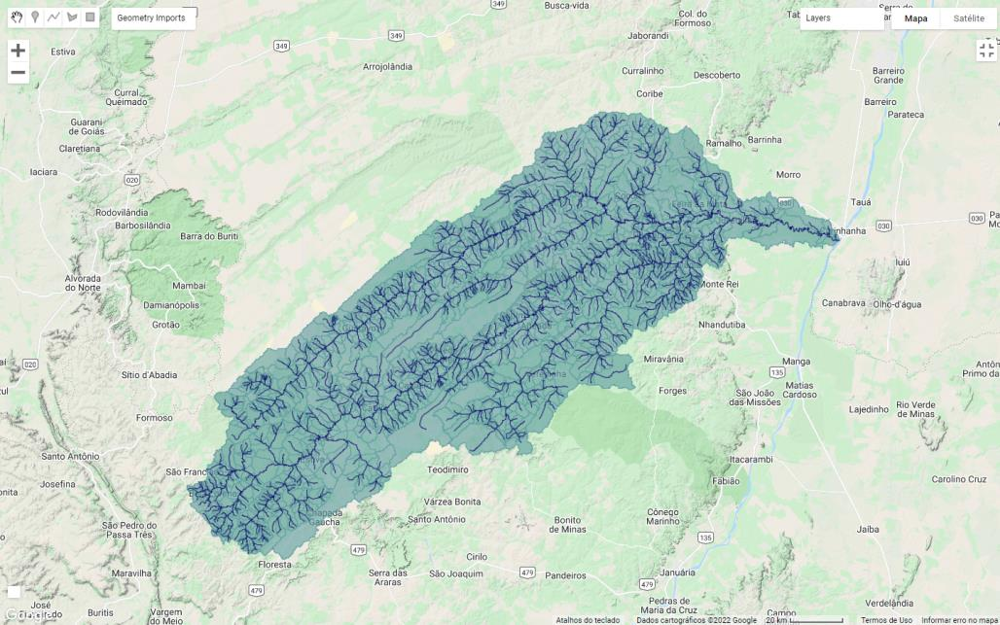

**Figura 10. Resultado da aplicação da ferramenta para a bacia do rio Carinhanha.**

Após acionado este botão, uma série de botões serão apresentados mais abaixo na ferramenta (Figura 11). Cada botão carrega o nome de um arquivo de saída ou arquivo intermediário do processamento da ferramenta. Ao clicar em um desses botões, o arquivo será plotado no mapa da plataforma.

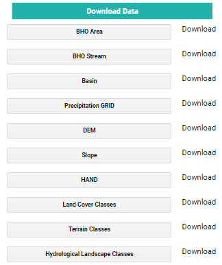

**Figura 11. Botões gerados após a aplicação da ferramenta para a plotagem e download dos dados.**

Na versão aplicativo da ferramenta, ao apertar esse botão também será gerado um link para o download do dado, logo ao lado onde está escrito “Download”. Clicando no link o arquivo é baixado diretamente para o computador do usuário em poucos minutos.

Já na versão do editor de código da ferramenta, o download é realizado a partir do botão ao lado escrito “Download”. Esse botão iniciará uma tarefa na aba “Tasks” onde o usuário deverá acionar o comando “run” para iniciar o download, da forma como é apresentado na Figura 12. Para seguir para as próximas etapas, utilizaremos os arquivos BHO Area, BHO Stream, Precipitation GRID, DEM e Hydrological Landscape Classes.

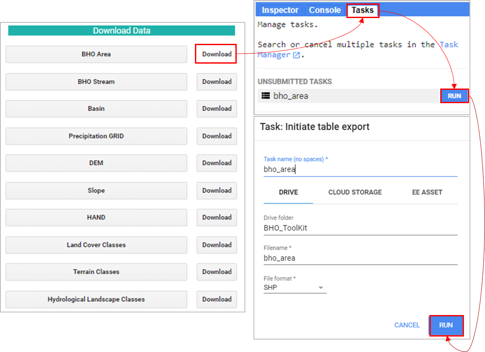

**Figura 12. Download dos arquivos a partir da versão do editor de códigos da ferramenta.**

### 4.1.2. Formas alternativas para obter os dados de entrada

Os arquivos vetoriais podem ser obtidos diretamente no Portal de Metadados Geoespaciais da ANA, que disponibiliza a [BHO250](https://metadados.snirh.gov.br/geonetwork/srv/api/records/0f57c8a0-6a0f-4283-8ce3-114ba904b9fe), a [BHO5k](https://metadados.snirh.gov.br/geonetwork/srv/api/records/f7b1fc91-f5bc-4d0d-9f4f-f4e5061e5d8f), a [BHO50k](https://metadados.snirh.gov.br/geonetwork/srv/api/records/4fd91f0d-f34f-4fca-a961-c2dcb3e0446e), a [BHO multiescalas](https://metadados.snirh.gov.br/geonetwork/srv/api/records/0c698205-6b59-48dc-8b5e-a58a5dfcc989) e a [Base Hidrográfica Atlas-Estudos (BHAE)](https://metadados.snirh.gov.br/geonetwork/srv/por/catalog.search#/metadata/8ad07d33-1677-481d-bc61-ed5ca204926f). O modelo digital de elevação (MDE) também pode ser obtido de outras bases, desde que cubra a área de estudo.

O usuário pode gerar as unidades de resposta hidrológica (URHs) pelo método que desejar, combinando, por exemplo, informações de modelos digitais de elevação, mapas de solo e mapas de cobertura da terra para representar diferenças no relevo, nos solos e na ocupação da área de estudo. O mapa raster resultante deve conter classes identificadas por números inteiros consecutivos de 1 a N, que depois serão incorporadas ao modelo MGB.

## 4.2. Construindo os arquivos de entrada do MGB

Para começar a construção dos arquivos de entrada do MGB, primeiro clicamos no ícone do plugin. Será exibida uma janela com três abas (Step 1, Step 2, e Step 3), como mostra a Figura 13. O primeiro passo (Step 1) é delimitar as subbacias que utilizaremos na nossa área de estudo. Caso o usuário não vá dividir a região em subbacias, pode-se pular essa etapa.

Para a realização do Step 1, primeiro carregamos os arquivos de entrada obtidos na seção 4.1. Em “BHO Area file” selecione o arquivo vetorial contendo a área da bacia hidrográfica com suas respectivas minibacias. Em “BHO Stretch file” selecione o arquivo vetorial contendo os trechos de drenagem. Em “Digital Elevation Model” selecione o arquivo raster do MDE da bacia. Em “Outlet code (“cobacia”)”, insira os códigos “cobacia” correspondentes aos exutórios de cada subbacia. No caso do rio Carinhanha, usaremos 4 subbacias, definidas pelos exutórios cujos códigos são 67658111, 6765823391, 6765841331, e 6765859. No campo “Output Directory” selecione uma pasta para salvar os resultados. O último passo é clicar em “Run”, aguardar para que o processamento chegue em 100%.

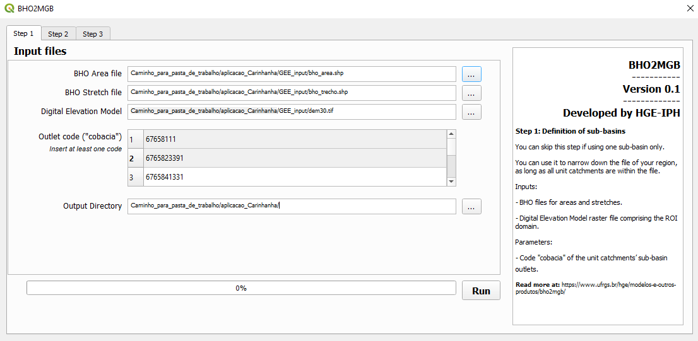

**Figura 13. Passo 1 da ferramenta BHO2MGB**

Ao final do passo 1, são gerados os arquivos vetoriais roi_areas.shp e roi_trecs.shp na pasta “output” criada dentro da pasta de trabalho. Podemos carregar esses arquivos no QGIS e visualizá-los para checar se as subbacias definidas estão de acordo com o que desejamos. Para isso, podemos categorizar a visualização no QGIS de acordo com a coluna sub do arquivo de areas, conforme apresentado na Figura 14.

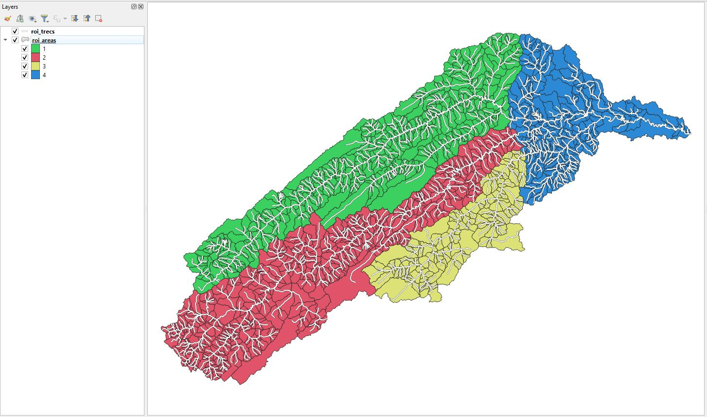

**Figura 14. Arquivos de saída do passo 1.**

O passo 2 é a etapa em que as minibacias da BHO original são modificadas para se adequar melhor à simulação no MGB. Isso é feito agregando minibacias adjacentes para atenderem (1) a um comprimento de trecho mínimo (Lmin) e (2) a uma área de drenagem a montante mínima (Amin). Uma vez finalizado o passo 1, na janela do passo 2 já estarão os caminhos dos arquivos que serão utilizados (`roi_area.shp` e `roi_trecs.shp`), como apresenta a Figura 15. Podem ser alterados os parâmetros “Minum contruting area”, representando a menor unidade de área a montante (Amin) e “Minimum stream length”, representando o menor comprimento do trecho de drenagem (Lmin). Quanto menores os valores destes dois parâmetros, mais fielmente será seguida a discretização original da BHO, e mais lento será o processamento do modelo durante as simulações. Os valores padrão (30 km² para Amin e 6 km para Lmin) são uma boa opção que não compromete demasiadamente o tempo de processamento e altera minimamente a BHO original. Clique em “Run” para realizar o processamento do passo 2.

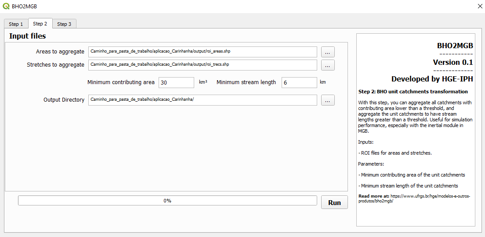

**Figura 15. Passo 2 da ferramenta BHO2MGB.**

Como resultados do Passo 2, são gerados os arquivos mareas.shp e mtrecs.shp, que representam os arquivos de áreas e trechos, respectivamente, das minibacias agregadas para atingirem os critérios de Lmin e Amin. Esses arquivos vetoriais podem ser carregados no QGIS para conferência do usuário, como mostra a Figura 16. Observe que o número de minibacias é consideravelmente menor e mais homogêneo em tamanho em relação a BHO original (Figura 14), o que vai facilitar o processo de simulação no MGB.

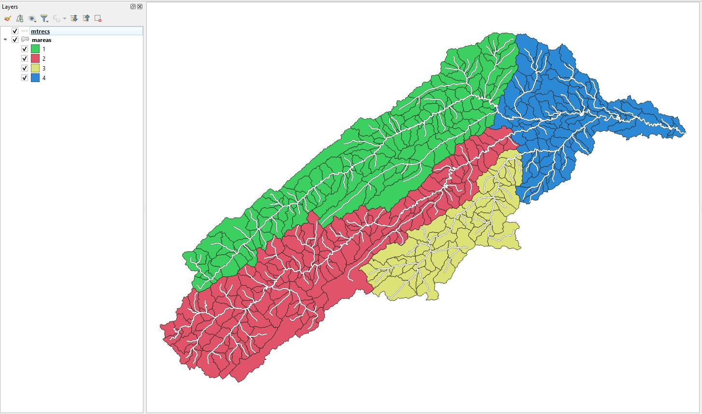

**Figura 16. Arquivos de saída do passo 2.**

Finalmente, no passo 3, vamos escrever os arquivos de entrada para o MGB, MINI.gtp e `COTA-AREA.flp`. Os arquivos de entrada já vieram carregados das etapas anteriores, com exceção do arquivo raster de unidades de resposta hidrológica (HRU). Este arquivo foi obtido na seção 4.1 deste manual, sob o nome de hlc.tif, e deve ser carregado onde indicado na Figura 17. Nessa etapa, além de carregar os arquivos, também definimos os parâmetros hidráulicos e geomorfolóficos que vão ser utilizados para escrever as informações das minibacias. Na área “River Hidraulic Options” devemos definir os campos “Set maximum reach slope to” e “Set minimum reach slope to” (máximas e mínimas declividades), e também o coeficiente de Manning em “Manning’s coefficient”. No caso do rio Carinhanha, dexaremos os valores default. No campo “Bankfull Geomorphic Relationships” é possível adequar os parâmetros de geometria do rio com base na área de drenagem. Em “Channel Width” definimos a largura e em “Channel Depth” a profundidade. Para a nossa bacia, utilizaremos os parâmetros apresentados na Figura 17 (a = 0.19; b = 0.52; c = 0.33; d = 0.66). Clicando em “Run” será concluída a última etapa do pré‑processamento, que pode levar algum tempo para rodar por completo.

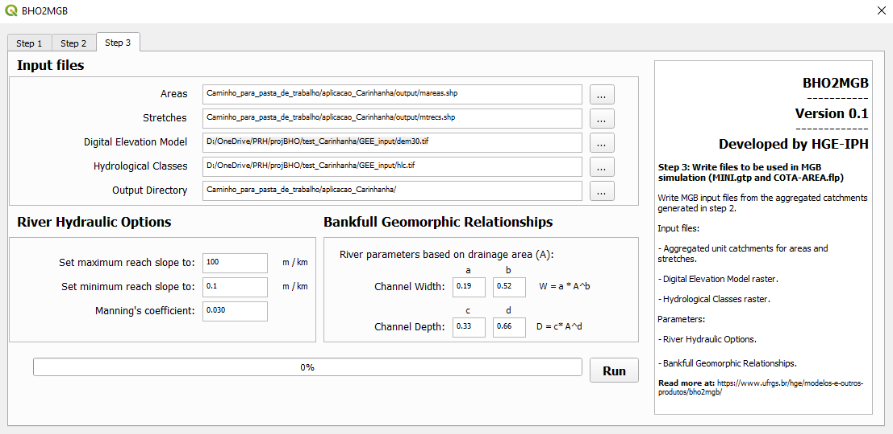

**Figura 17. Passo 3 da ferramenta BHO2MGB.**

Após o processamento completo do Passo 3, são gerados diversos arquivos resultantes na pasta “output”. É possível visualizar os arquivos raster hand.tif (Figura 18), apresentando os valores de altura à rede de drenagem mais próxima da bacia hidrográfica, e ltnd.tif (Figura 19), apresentando os valores de distância à rede de drenagem mais próxima. Estes arquivos são utilizados para cálculos internos do BHO2MGB, mas sua visualização é interessante para compreender os processos hidrológicos na bacia. Além disso, são criados os arquivos MINI.gtp, que contém as informações apresentadas na Tabela 3, e `COTA-AREA.flp`, que contém informações de área inundada por incremento de cota em cada minibacia. Estes dois últimos arquivos serão utilizados como dados de entrada do MGB.

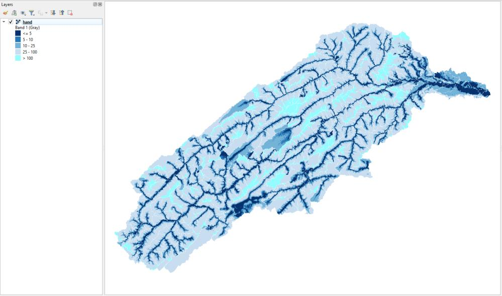

**Figura 18. Arquivo HAND da bacia do rio Carinhanha.**

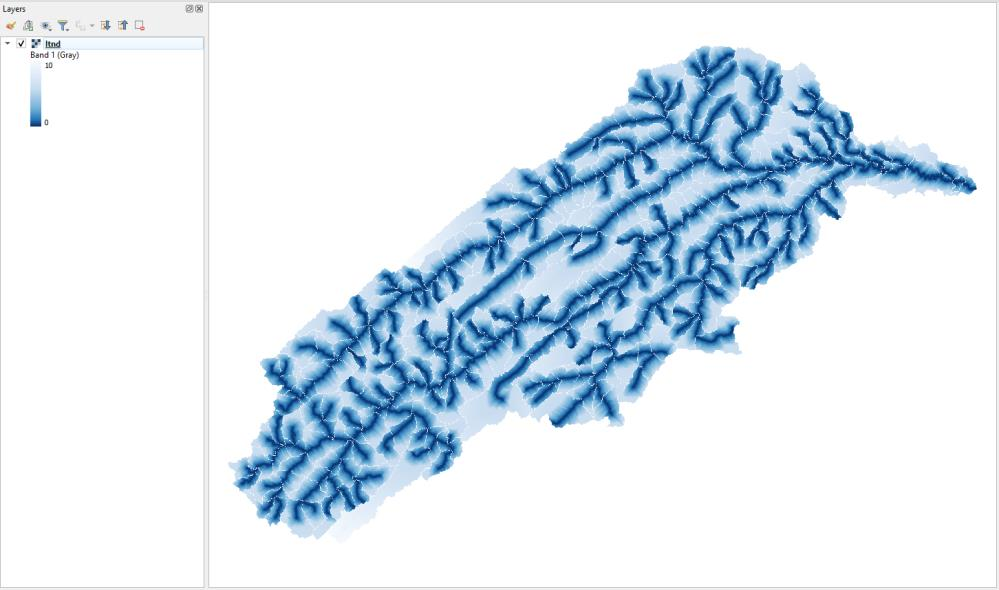

**Figura 19. Arquivo LTND da bacia do rio Carinhanha.**

**Tabela 3. Informações do arquivo `MINI.gtp`.**

| Atributo | Informação |
|---|---|
| `CatID` | Código da minibacia original. |
| `MINI` | Número da minibacia em ordem topológica, das minibacias de cabeceira até a minibacia exutório. |
| `Xcen` e `Ycen` | Coordenadas do centróide. |
| `Sub` | Sub-bacia à qual pertence a minibacia. |
| `Area` | Área de drenagem da minibacia, em km². |
| `AreaM` | Área de drenagem total a montante de cada minibacia, em km². |
| `Ltr` | Comprimento do rio principal que atravessa uma minibacia. |
| `Str` | Declividade do rio principal dentro de uma minibacia. |
| `Lrl` | Comprimento do afluente mais longo dentro de uma minibacia. |
| `Srl` | Declividade do afluente mais longo dentro de uma minibacia. |
| `MiniJus` | Número da minibacia localizada imediatamente a jusante. |
| `Ordem` | Ordem do curso d’água da minibacia. |
| `Hdr` | Flag utilizado em versões anteriores do modelo para acionar o modelo hidrodinâmico nas minibacias. |
| `Width` | Largura do trecho baseada na equação geomorfológica. |
| `Depth` | Profundidade do trecho baseada na equação geomorfológica. |
| `Manning` | Rugosidade de Manning. |
| `BLC_X` | Porcentagem da área da minibacia ocupada por cada unidade de resposta hidrológica; X varia de 1 até o número de URHs. |

## 4.3. Rodando simulação no MGB

Com os arquivos gerados nos passos anteriores é possível aplicar o MGB a partir da interface gráfica disponível para o software QGIS. Os passos para realizar a simulação serão descritos nos itens a seguir e para acompanha-los é necessário que o usuário tenha feito o download e instalação do QGIS a partir da versão 3 do software (https://qgis.org/en/site/forusers/download.html) e também da interface do MGB disponível no site do grupo de Pesquisa de Grande Escala (https://www.ufrgs.br/hge/mgb/downloads/mgb-4-6-2/).

### 4.3.1. Descrição das Unidades de Resposta Hidrológica

O primeiro passo é realizar uma descrição das Unidades de Resposta Hidrológica (URHs) através da ferramenta “HRCs Description” da interface do MGB. Nesta ferramenta irão constar duas colunas, uma denominada “HRC” a qual deve ser preenchida com códigos abreviados que representam as URHs e a outra denominada “Description” onde deverá constar a descrição do código inserido na coluna anterior. Neste manual será utilizado como URH o arquivo de HLCs obtido na seção 4.1.1. A tabela foi elaborada de acordo com a Figura 20 e salva como "HRC_descrip.hrc".

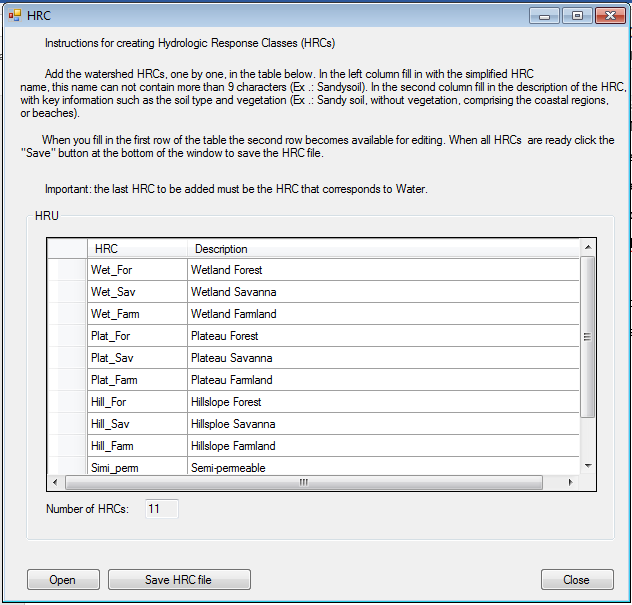

**Figura 20. Descrição das classes de resposta hidrológica.**

### 4.3.2. Precipitação

Para adquirir dados de chuva e vazão para incorporar ao modelo MGB-IPH pode-se utilizar a ferramenta ANA data acquisition, que permite o download automático de vários postos pluviométricos e fluviométricos da sua região de interesse. A obtenção de dados de chuva a partir desta ferramenta está descrita no manual de aplicação da interface do MGB (Alvez et al., 2020). Neste manual serão utilizados os dados de precipitação da base de dados Climate Hazards Group InfraRed Precipitation with Station data (CHIRPS) (Funk et al., 2015) extraídos a partir do aplicativo MGB-BHO Tool Kit na seção 4.1.1.

Os dados de precipitação devem ser interpolados e agregados a nível das minibacias do MGB, mas antes de realizar a interpolação dos dados extraídos do aplicativo é necessário realizar um pré‑processamento do arquivo .csv para separar os dados em arquivos .txt para cada ponto do GRID e atualizar as bases de dados internas da interface do modelo. Para isso, abra a ferramenta “GEE_Precipitation” (Figura 21) situada na aba “Tools” da interface. Em input selecione o arquivo .csv com o GRID de precipitação gerado na seção 4.1.1. e em output selecione uma pasta onde serão armazenados os arquivos .txt com a série temporal de precipitação para cada ponto do GRID. Por fim clique em “Run” e aguarde a confirmação do processamento.

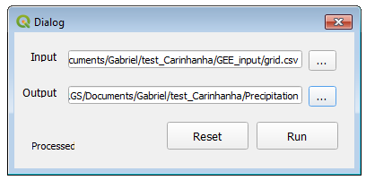

**Figura 21. Aplicação da ferramenta GEE Precipitation.**

O processamento pode demorar, mas a geração dos arquivos de saída pode ser acompanhada a partir da pasta informada no output da ferramenta. Devem ser totalizados 720 arquivos .txt (Figura 22) na pasta, correspondente ao número de pontos no GRID.

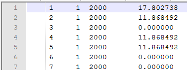

**Figura 22. Exemplo de arquivo de saída da ferramenta GEE Precipitation. A primeira coluna corresponde ao dia do mês, a segunda ao mês do ano, a terceira ao ano e a quarta ao dado de precipitação diária.**

Após gerados os arquivos de saída, o usuário pode prosseguir para a interpolação dos dados de precipitação para as minibacias. Embora os dados que estamos utilizando não sejam provenientes da Agência Nacional de Águas a ferramenta “Using ANA Data (Brazil)” realiza a leitura e interpolação dos dados no formato que preparamos a partir do passo anterior. Portanto, abra a ferramenta (Figura 23) localizada na aba “Precipitation” do menu principal. Clique no botão “Load data” e selecione todos os arquivos gerados a partir do “GEE Precipitation”. Após carregar todos os dados na ferramenta insira o arquivo MINI.gtp gerado na seção 4.2 no bloco do canto superior direito. Confira se a data definida para a interpolação corresponde com a disponibilidade de dados dos arquivos de entrada e selecione uma pasta para armazenar o arquivo de saída. Aqui o arquivo de saída foi salvo como “PRECIP”.

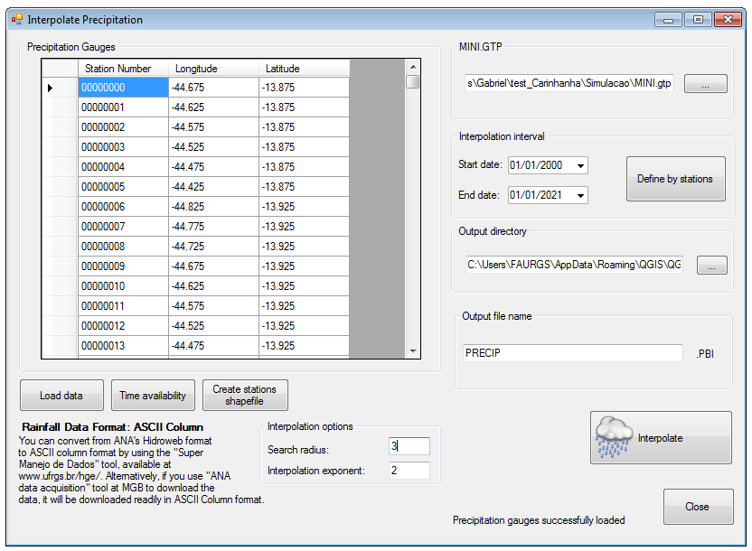

**Figura 23. Ferramenta de interpolação de dados de chuva.**

Também é interessante criar um shapefile dos pontos do GRID para poder visualizar a localização dos mesmos na bacia hidrográfica. Para isso clique na opção “Create stations shapefile”. A Figura 24 mostra o GRID de precipitação utilizado neste manual.

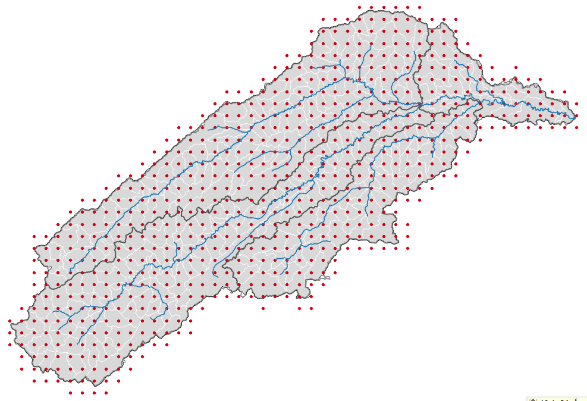

**Figura 24. GRID de precipitação utilizado na interpolação dos dados de chuva.**

Após realizada a interpolação dos dados de chuva, volte a ferramenta “GEE Precipitation” e clique no botão “Reset” para restaurar a base de dados interna da interface do MGB.

### 4.3.3. Vazões observadas

Para adquirir dados de vazão para a calibração do modelo MGB-IPH você pode utilizar a ferramenta “ANA data acquisition”, que permite o download automático de vários postos fluviométricos da sua região de interesse. Na ferramenta, marque a opção “Discharge” no topo e indique o mesmo período de dados utilizado para os dados de precipitação na seção anterior para baixar os dados de vazão. Importante manter a mesma data para chuva e vazão. Crie um arquivo .txt como o ilustrado na Figura 25 e o salve como “gauges.txt”.

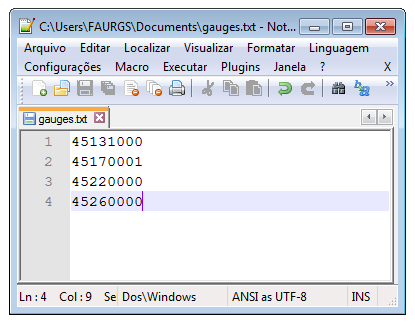

**Figura 25. Códigos das estações fluviométricas selecionadas para calibração.**

Em seguida marque a opção “Gauges” como tipo de dado de entrada. Indique o arquivo “gauges.txt”. Indique uma pasta para armazenar as séries de vazão dos postos fluviométricos em “Destination folder”, e baixe os dados em “Download Data” (Figura 26).

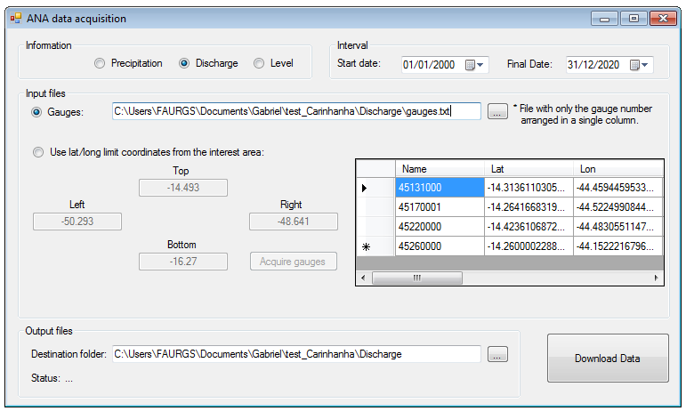

**Figura 26. Ferramenta ANA data acquisition para download automático de dados de vazão da ANA.**

Os dados de vazão calculados pelo MGB serão comparados aos dados de vazão observados nos postos fluviométricos. Para isto é necessário gerar um arquivo com dados de vazão observada utilizando a ferramenta “Discharge” do menu.

Os dados de vazão devem ser um arquivo texto para cada estação, e devem estar em formato coluna. Neste manual, serão utilizados os dados recém baixados pelo programa automático de download de dados da ANA.

Para gerar o arquivo de vazão para o MGB, é importante que visualize a disponibilidade temporal das estações baixadas. O período de dados deve ser exatamente o mesmo que no caso da chuva interpolada, isto é, foi adotado o intervalo de 01/01/2000 até 31/12/2020. Também é necessário informar qual é o número da minibacia correspondente ao posto fluviométrico. Para isto, é necessário ter o shapefile dos postos fluviométricos, então clique em "Generate shapefile".

Existe a possibilidade de preencher as minibacias de forma automática, selecionando a opção “Automatically Suggest Catchment”. Ao selecionar esta opção, uma janela abrirá solicitando que carregue o arquivo MINI.gtp gerado anteriormente. Após selecionar, o programa vai sugerir automaticamente minibacias associadas às estações fluviométricas. Entretanto, em alguns casos a localização da estação fica dentro de uma minibacia incorreta. Isso ocorre porque as coordenadas dos postos fluviométricos fornecidas pela ANA são aproximadas, e porque há incertezas nos dados da BHO. Assim, é fundamental checar se a mini-bacia escolhida automaticamente pelo programa é a mais correta. Uma forma de fazer esta verificação é comparando a área de drenagem da mini-bacia escolhida com a área de drenagem do posto fluviométrico, que é informada no Hidroweb da ANA. Para isso, adicione o shapefile de postos fluviométricos ao projeto. Para cada posto é possível descobrir o número da minibacia correspondente adicionando o label do campo Mini no layer dos centroides das minibacias, e usando as ferramentas de zoom com o shapefile das estações carregado no projeto. A Figura 27 apresenta as estações utilizadas e o zoom dado no shapefile das minibacias e das estações para verificação. Para este manual, as estações associadas às minibacias são apresentadas na Figura 28. O arquivo de vazões observadas gerado para o rio Carinhanha recebeu o nome `QOBS.qob`. Em seguida, clique no botão “Create observed Discharge file” e feche a janela.

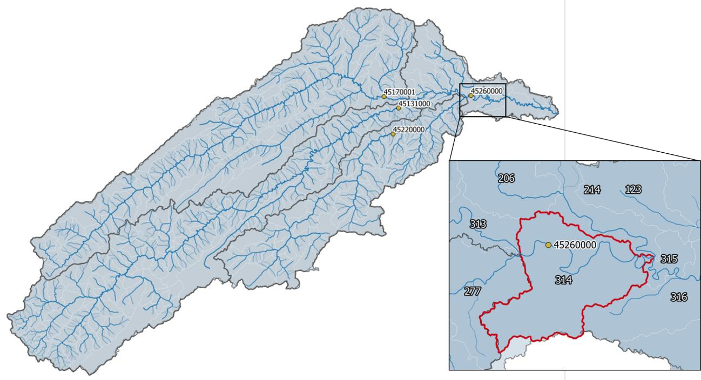

**Figura 27. Verificação da minibacia associada à estação fluviométrica.**

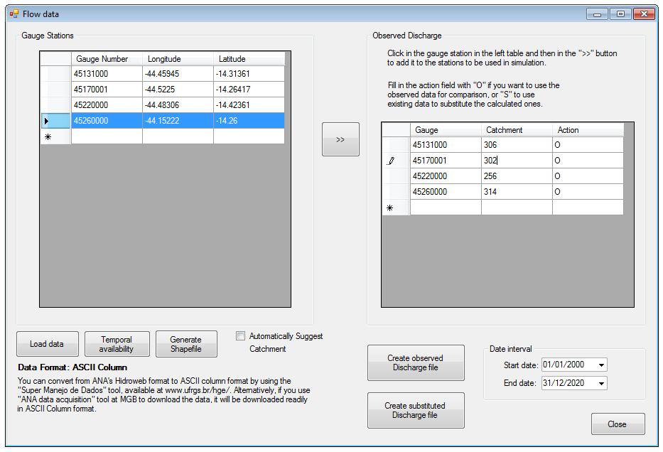

**Figura 28. Ferramenta das vazões observadas com a correlação das minibacias com estações fluviométricas.**

### 4.3.4. Dados de Clima

Para calcular a evapotranspiração no modelo MGB são utilizados dados de temperatura, umidade relativa do ar, velocidade do vento, pressão atmosférica e insolação (horas de sol por dia). Na interface do MGB existem três opções de entrada de dados de clima. Entretanto, neste manual abordaremos apenas a opção que utiliza a base de dados interna de climatológicas de 1960-1990 calculadas pelo INMET para todo o Brasil.

Na tabela da esquerda, existe uma lista das estações climatológicas disponíveis. Para utilizar uma dada estação, selecione na tabela da esquerda e a transfira para a tabela da direita pelo botão ">>". Caso queira saber quais são as estações climatológicas próximas à sua área de estudo, você pode criar um shapefile das estações clicando em "Create Shapefile of Climatological Stations from MGB database", adicionar o shapefile ao projeto e localizar as estações mais próximas (Figura 29). Neste manual utilizaremos as estações apresentadas na Figura 30.

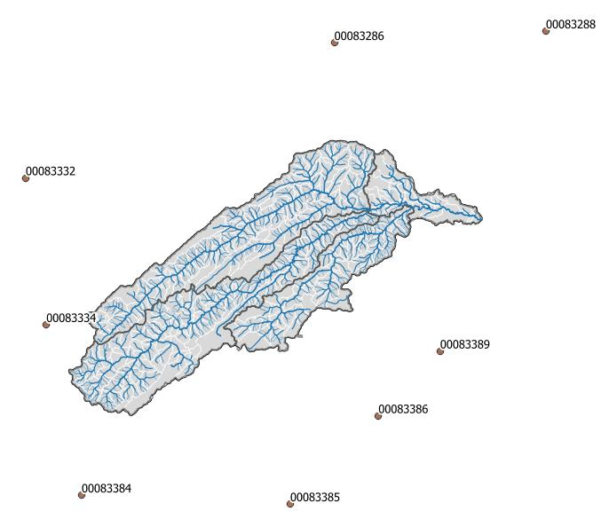

**Figura 29. Estações climatológicas próximas a bacia do rio Carinhanha.**

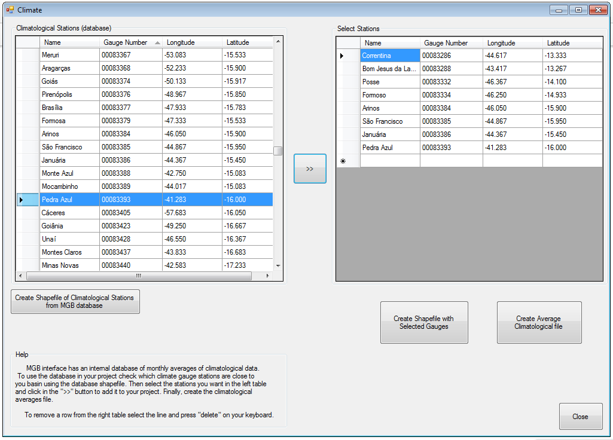

**Figura 30. Interface da base de dados interna de clima do MGB.**

Após ter selecionado as estações desejadas, e as carregado na tabela da direita de "Selected stations", crie os arquivos de normais climatológicas ("Create Average Climatological file").

### 4.3.5. Definição dos Parâmetros de Vegetação

Para definir os parâmetros de vegetação deve ser acionada a ferramenta “Vegetation Parameters” do menu do MGB (Figura 31). Para iniciar um novo arquivo de parâmetros de vegetação, é necessário clicar no botão “New vegetation parameters file”. O programa pergunta se o usuário deseja utilizar um arquivo de blocos. A opção correta é “Sim”, e então o programa permitirá selecionar o arquivo de blocos gerado anteriormente de extensão .hrc.

Algumas sugestões de valores que devem ser adotados aparecem na própria janela de edição dos parâmetros de vegetação. A Tabela 4 apresenta os valores adotados para os parâmetros de vegetação na aplicação na bacia do rio Carinhanha que devem ser inseridos na ferramenta. Por simplificação, assumimos valores constantes para os diferentes meses.

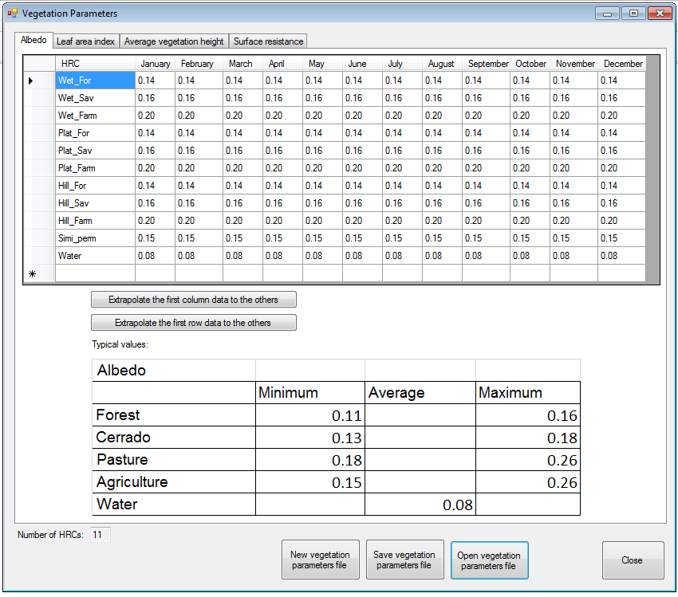

**Figura 31. Janela da ferramenta de definição dos parâmetros fixos.**

**Tabela 4. Parâmetros de vegetação adotados para cada unidade de resposta hidrológica na aplicação para o rio Carinhanha.**

| HRC | Albedo | Leaf Area Index | Average Vegetation Height | Surface Resistance |
|---|---:|---:|---:|---:|
| `Wet_For` | 0.14 | 6.00 | 20.00 | 100.00 |
| `Wet_Sav` | 0.16 | 3.00 | 8.00 | 80.00 |
| `Wet_Far` | 0.20 | 2.00 | 1.20 | 70.00 |
| `Hil_For` | 0.14 | 6.00 | 20.00 | 100.00 |
| `Hil_Sav` | 0.16 | 3.00 | 8.00 | 80.00 |
| `Hil_Far` | 0.20 | 2.00 | 1.20 | 70.00 |
| `Pla_For` | 0.14 | 6.00 | 20.00 | 100.00 |
| `Pla_Sav` | 0.16 | 3.00 | 8.00 | 80.00 |
| `Pla_Far` | 0.20 | 2.00 | 1.20 | 70.00 |
| `Sem_Per` | 0.15 | 1.00 | 0.50 | 70.00 |
| `Wat_Bod` | 0.08 | 1.00 | 0.10 | 0.00 |

Quando terminar de preencher os valores clique em “Save vegetation parameters file”. Neste caso chamaremos o arquivo de “PARFIX” sendo que o mesmo recebe a extensão .FIX e o salvaremos na raiz da pasta MGB.

### 4.3.6. Definição dos Parâmetros de Solo

Os parâmetros de solo costumam ser alterados no processo de calibração e, também, estão associados às URHs. Para definir os parâmetros de solo deve ser acionada a ferramenta “Soil Parameters” e iniciar um novo arquivo de parâmetros de solo. Para isso, é necessário abrir o arquivo de blocos, o arquivo de minibacias (MINI.gtp) e depois clicar no botão “New soil parameters file”. A Figura 32 mostra janela com os valores preenchidos e a Tabela 5 mostra os valores adotados para cada classe de resposta hidrológica.

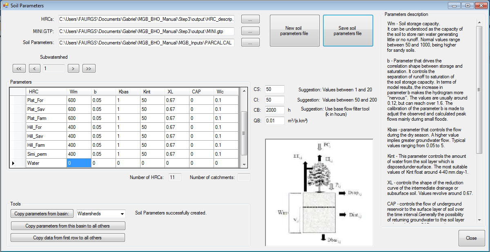

**Figura 32. Janela da ferramenta de definição dos parâmetros calibráveis.**

**Tabela 5. Parâmetros de solo adotados para a bacia do rio Carinhanha.**

| HRC | Wm | b | Kbas | Kint | XL | CAP | Wc |
|---|---:|---:|---:|---:|---:|---:|---:|
| `Wet_For` | 1600.00 | 0.34 | 2.90 | 0.80 | 0.67 | 0.00 | 0.10 |
| `Wet_Sav` | 1660.00 | 0.34 | 2.30 | 1.20 | 0.67 | 0.00 | 0.10 |
| `Wet_Far` | 1350.00 | 0.42 | 1.90 | 0.70 | 0.67 | 0.00 | 0.10 |
| `Hil_For` | 5000.00 | 0.33 | 2.50 | 1.10 | 0.67 | 0.00 | 0.10 |
| `Hil_Sav` | 5100.00 | 0.11 | 1.50 | 1.10 | 0.67 | 0.00 | 0.10 |
| `Hil_Far` | 4400.00 | 0.37 | 1.80 | 0.80 | 0.67 | 0.00 | 0.10 |
| `Pla_For` | 5300.00 | 0.31 | 2.10 | 1.10 | 0.67 | 0.00 | 0.10 |
| `Pla_Sav` | 5300.00 | 0.07 | 1.60 | 1.00 | 0.67 | 0.00 | 0.10 |
| `Pla_Far` | 5300.00 | 0.16 | 2.40 | 0.80 | 0.67 | 0.00 | 0.10 |
| `Sem_Per` | 1400.00 | 0.20 | 2.90 | 1.30 | 0.67 | 0.00 | 0.10 |
| `Wat_Bod` | 1000.00 | 0.11 | 2.10 | 1.00 | 0.67 | 0.00 | 0.10 |

É importante não se esquecer de preencher os valores dos parâmetros CS, CI, CB e QB. Na aplicação na bacia do rio Carinhanha foi adotado os valores Cs = 50; Ci = 130; Cb = 8400; Qb = 0.01.

Quando todos os parâmetros estiverem preenchidos, clique no botão “Save soil parameters” file e salve o arquivo de parâmetros calibráveis para o modelo. Salvaremos com o nome de "PARCAL.CAL”.

### 4.3.7. Criação de um projeto para simulação

Para podermos rodar a simulação, é necessário agregar as informações que geramos nos últimos passos em um único arquivo de projeto. Para isto clique na ferramenta “Create/Edit Simulation Project” no menu do MGB e uma janela como a da Figura 33 irá abrir. Vamos agora preencher cada um dos campos com os arquivos corretos. É importante ter o cuidado para que nenhum arquivo apresente caracteres especiais no nome ou nas pastas dos arquivos, para evitar futuros erros na simulação.

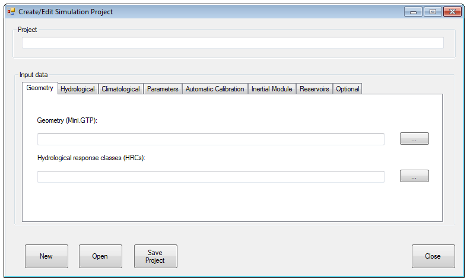

**Figura 33. Ferramenta de projeto para entrada na simulação.**

Primeiramente digite um nome para o seu projeto no campo Project na parte superior da janela. No nosso caso iremos chamá-lo “projeto_carinhanha”. Em seguida no campo Geometry indique o arquivo “MINI.gtp” que foi gerado a partir da ferramenta BHO2MGB na seção 4.2. Logo abaixo no campo Hydrologic response classes entre com o arquivo de extensão .hrc criado na seção 4.3.1 que havíamos chamado de “HRC_descrip”.

Na aba Hydrological entraremos no campo Interpolated Precipitation com o arquivo “PRECIP” que geramos na seção 4.3.2 enquanto que no campo Observed Discharge indique o arquivo “QOBS.qob” que criamos na seção 4.3.3 Deixe o campo Replaced Discharge vazio. Na aba Climatological indique o arquivo de médias climatológicas no campo Climatological Averages que chamamos de “CLIMATE.cln” na seção 4.3.4. Deixe a opção Daily climate data desmarcada. Na aba Parameters busque o arquivo de parâmetros de vegetação (PARFIX.FIX) e o de parâmetros solo (PARCAL.CAL) no primeiro e segundo campo respectivamente.

Se a intenção do usuário for realizar a simulação por Muskingum-Cunge, clique em Save Project. Caso queira utilizar o modelo inercial para simulação, na aba Inertial Module selecione o arquivo chamado “COTA_AREA.FLP” gerado com a ferramenta BHO2MGB na seção 4.2. Clique em Save Project.

### 4.3.8. Simulação

Com o projeto preparado abra a janela de simulação do MGB no menu principal em “Run Simulation”. É necessário especificar o arquivo de projeto que será simulado. No caso do rio Carinhanha vamos simular o projeto recém-criado “projeto_carinhanha.mgb" (Figura 34).

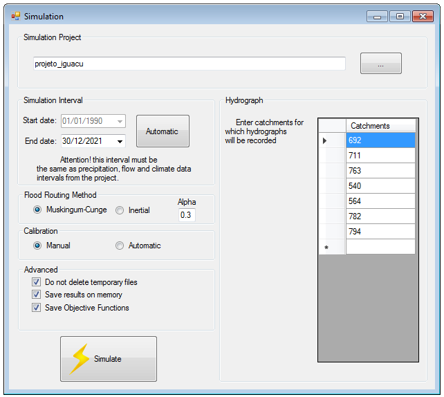

**Figura 34. Janela de simulação do MGB com o projeto carregado.**

Ao especificar este projeto, o programa identifica automaticamente o período que se pretende simular, bem como as minibacias com dados de vazão e onde os resultados devem ser gravados para realizarmos a comparação de dados calculados e observados. Caso o usuário deseje os resultados de vazão em outros locais da bacia, basta identificar o número da minibacia correspondente ao local desejado e adicionar este número ao fim da lista de minibacias.

Caso tenha optado pela utilização de simulação por Muskingum-Cunge na etapa de criação do projeto, “Muskingum-Cunge” estará selecionado em Flood Routing Method, ao passo que se tiver adicionado o arquivo “COTA_AREA.FLP” no projeto de simulação, o MGB automaticamente seleciona a opção “Inertial” na janela de simulação.

As opções no quadro Advanced e demais campos devem ser mantidas como estão. Principalmente a opção de “Save results on memory”, pois é ela que nos permitirá o uso das ferramentas gráficas de visualização de resultados.

A opção Alpha está diretamente relacionado ao intervalo de tempo da simulação inercial: quanto maior o alpha, maior o dt da simulação. Se o dt é maior, então a simulação roda mais rápido, porém pode gerar problemas numéricos como instabilidade. Logo, em casos de instabilidade, recomenda-se baixar o valor do alpha, assim a simulação vai ficar mais lenta, porém se possível mais estável.

Ao clicar em “Simulate” o programa executável (Fortran) do MGB será chamado para realizar a simulação. Isto pode levar alguns minutos se a bacia for grande (com muitas minibacias e URHs) ou caso esteja sendo simulado o modelo inercial. Para a bacia do rio Carinhanha, com o modelo inercial, esta etapa é demorada.

Durante a rodada do programa na tela preta é pedido que você dê enter em alguns momentos e, se tudo ocorrer bem, aparecerá uma mensagem dizendo que a simulação foi feita com sucesso. Os resultados do modelo MGB foram todos salvos na pasta onde está o arquivo do projeto do MGB.

## 4.4. Visualização dos resultados

Os resultados podem ser visualizados utilizando as ferramentas no menu Results do MGB.

### 4.4.1. Comparação de hidrograma calculado e observado

Clique na opção de nome “Compare observed and calculated hydrographs”. Neste momento é necessário que o layer “mini” das minibacias no menu de layers esteja selecionado e visível no projeto do QGIS. O próprio programa emite um aviso neste sentido. No momento em que você seleciona a opção de visualizar os hidrogramas fica habilitada a ferramenta de seleção com o mouse. Para visualizar os hidrogramas basta então selecionar a minibacia que possua dados observados. Um gráfico será exibido como na Figura 35, referente ao posto fluviométrico Juvenília (45260000). A Figura 36 apresenta a série de vazões simuladas e observadas referentes a minibacia da estação fluviométrica São Gonçalo (45131000).

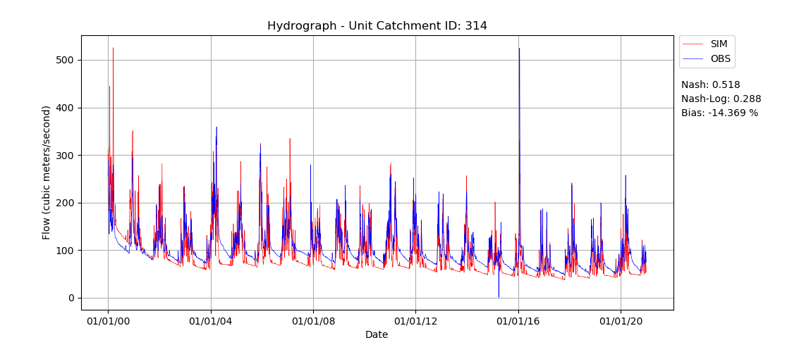

**Figura 35. Hidrograma de vazões calculadas e observadas da estação 45260000.**

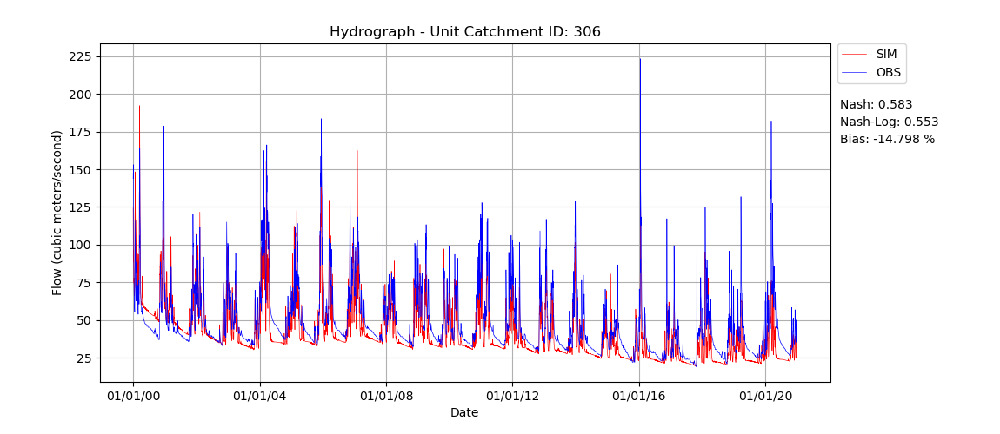

**Figura 36. Hidrograma de vazões calculadas e observadas da estação 45131000.**

### 4.4.2. Comparação de curva de permanência simulada e observada

Também é possível gerar gráficos de curvas de permanência nas minibacias utilizando a ferramenta “Compare flow duration” curves no menu Results. A Figura 37 mostra um exemplo de curvas de permanência geradas no posto fluviométrico Juvenília (45260000), localizada no rio Carinhanha. Observa-se que as vazões mínimas calculadas estão inferiores às vazões mínimas observadas. Isto pode ser melhorado calibrando os parâmetros do modelo.

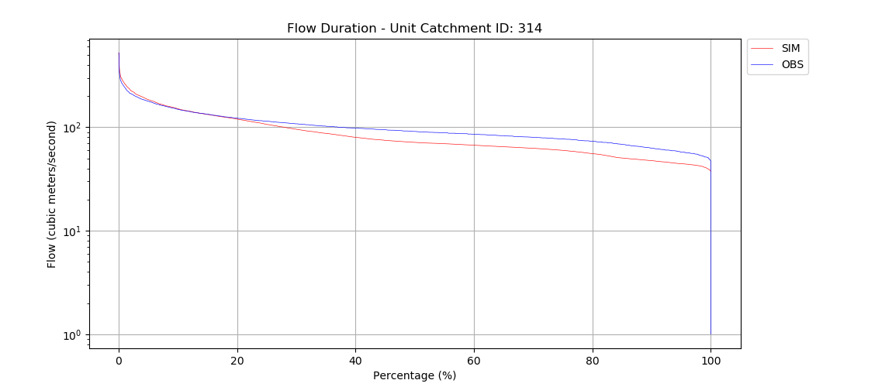

**Figura 37. Curvas de permanência calculada e observada para o posto 45260000.**

### 4.4.3. Visualização do hidrograma simulado

Caso o usuário deseje visualizar apenas o hidrograma resultante da simulação, mas não em um gráfico conjunto com o hidrograma observado, deve selecionar a opção “Visualize calculated hydrographs only” no menu Results. É possível por exemplo adicionar na janela de simulação uma minibacia que não possua dados de vazão observados para que o respectivo hidrograma seja visualizado nesta opção.

### 4.4.4. Visualização da curva de permanência simulada

Ainda no menu Results, é possível selecionar a opção “Visualize flow duration curves only”, que permite a visualização do resultado da curva de permanência simulada, em um gráfico sem a comparação com a curva de permanência observada.

### 4.4.5. Visualização da série de profundidades simulada

Se a simulação foi realizada com o modelo inercial, o MGB oferece também a visualização dos resultados de série temporal de profundidades de água. Para visualizar a série de níveis, acesse no menu Results a ferramenta “Visualize water depth time series”. A Figura 38 apresenta o resultado da simulação da série de profundidades do rio Carinhanha.

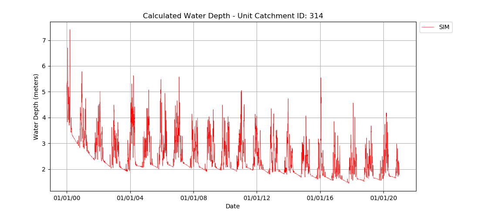

**Figura 38. Série de profundidades de água resultante da simulação do Carinhanha com o MGB Inercial.**

### 4.4.6. Visualização da área inundada simulada

Com a aplicação do Modelo Inercial, o MGB também oferece os resultados da simulação para área inundada. Assim como a série de níveis, o presente manual apresenta resultados de área inundada para toda a bacia do rio Carinhanha. Para visualizar a série de área inundada, clique em “Visualize flooded area time series” no menu Results. A Figura 39 apresenta o resultado da visualização da série de área inundada.

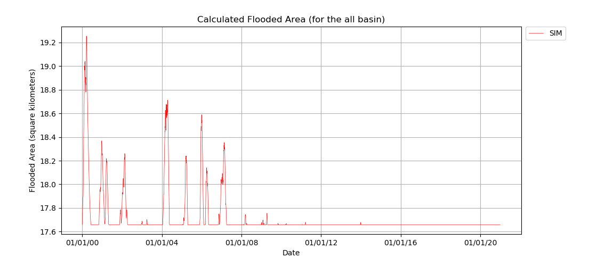

**Figura 39. Série de área inundada resultante da simulação do rio Carinhanha com o MGB Inercial.**

# 5. Referências

- **Alvez, M. E., Oliveira, A. M., Fan, F. M. & Paiva. (2020).** *Manual de aplicação do modelo MGB utilizando IPH-Hydro Tools.* [Arquivo PDF](https://drive.google.com/file/d/1YxrNHQhDZsBl0G_e39L7zLNF7ppArNYo/view).
- **COLLISCHONN, W., ALLASIA, D., DA SILVA, B. C. & TUCCI, C. E. M. (2007).** The MGB‑IPH model for large-scale rainfall—runoff modelling. *Hydrological Sciences Journal, 52*(5), 878–895. Taylor & Francis. [doi:10.1623/hysj.52.5.878](https://doi.org/10.1623/hysj.52.5.878).
- **Fan, F. M., Buarque, D. C. & Pontes, P. R. M. (2015).** UM MAPA DE UNIDADES DE RESPOSTA HIDROLÓGIA PARA A AMÉRICA DO SUL 8.
- **Farr, T. G., Rosen, P. A., Caro, E., Crippen, R., Duren, R., Hensley, S., Kobrick, M., et al. (2007).** The Shuttle Radar Topography Mission. *Reviews of Geophysics, 45*(2). [doi:10.1029/2005RG000183](https://doi.org/10.1029/2005RG000183).
- **Funk, C., Peterson, P., Landsfeld, M., Pedreros, D., Verdin, J., Shukla, S., Husak, G., et al. (2015).** The climate hazards infrared precipitation with stations—a new environmental record for monitoring extremes. *Sci Data, 2*(1), 150066. Nature Publishing Group. [doi:10.1038/sdata.2015.66](https://doi.org/10.1038/sdata.2015.66).
- **Hersbach, H., Bell, B., Berrisford, P., Hirahara, S., Horányi, A., Muñoz-Sabater, J., Nicolas, J., et al. (2020).** The ERA5 global reanalysis. *Quarterly Journal of the Royal Meteorological Society, 146*(730), 1999–2049. [doi:10.1002/qj.3803](https://doi.org/10.1002/qj.3803).
- **Huffman, G. J., Stocker, D. T. & Bolvin, E. J. (2019).** GES DISC Dataset: GPM IMERG Final Precipitation L3 Half Hourly 0.1 degree x 0.1 degree V06 (GPM_3IMERGHH 06). Retrieved May 24, 2022, from [https://disc.gsfc.nasa.gov/datasets/GPM_3IMERGHH_06/summary](https://disc.gsfc.nasa.gov/datasets/GPM_3IMERGHH_06/summary).
- **Jarvis, A., Reuter, H. I., Nelson, A. & Guevara, E. (2008).** CGIAR-CSI SRTM – SRTM 90m DEM Digital Elevation Database. Retrieved May 24, 2022, from [https://srtm.csi.cgiar.org/](https://srtm.csi.cgiar.org/).
- **NASA JPL. (2020).** NASADEM Merged DEM Global 1 arc second V001. NASA EOSDIS Land Processes DAAC. [doi:10.5067/MEASURES/NASADEM/NASADEM_HGT.001](https://doi.org/10.5067/MEASURES/NASADEM/NASADEM_HGT.001).
- **Rodell, M., Houser, P. R., Jambor, U., Gottschalck, J., Mitchell, K., Meng, C.-J., Arsenault, K., et al. (2004).** The Global Land Data Assimilation System. *Bulletin of the American Meteorological Society, 85*(3), 381–394. American Meteorological Society. [doi:10.1175/BAMS-85-3-381](https://doi.org/10.1175/BAMS-85-3-381).
- **Siqueira, V. A., Fleischmann, A., Jardim, P. F., Fan, F. M. & Collischonn, W. (2016).** IPH‑Hydro Tools: uma ferramenta open source para determinação de informações topológicas em bacias hidrográficas integrada a um ambiente SIG. *RBRH, 21*, 274–287. Associação Brasileira de Recursos Hídricos. [doi:10.21168/rbrh.v21n1.p274-287](https://doi.org/10.21168/rbrh.v21n1.p274-287).
- **Sorooshian, S., Hsu, K.-L., Braithwaite, D. K., Ashouri, H. & NOAA CDR Program. (2015).** PERSIANN-CDR: Daily Precipitation Climate Data Record from Multisatellite Observations for Hydrological and Climate Studies. *Bulletin of the American Meteorological Society, 96*(1), 69–83. [doi:10.1175/BAMS-D-13-00068.1](https://doi.org/10.1175/BAMS-D-13-00068.1).
- **Yamazaki, D., Ikeshima, D., Tawatari, R., Yamaguchi, T., O’Loughlin, F., Neal, J. C., Sampson, C. C., et al. (2017).** A high-accuracy map of global terrain elevations. *Geophysical Research Letters, 44*(11), 5844–5853. [doi:10.1002/2017GL072874](https://doi.org/10.1002/2017GL072874).
